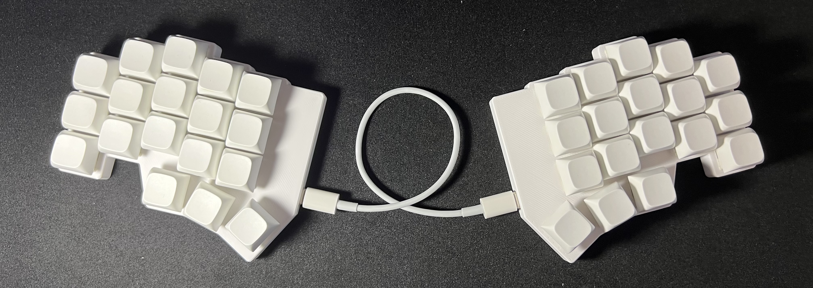

# cornifi keyboard

The cornifi keyboard is a split keyboard based on the [corne](https://github.com/foostan/crkbd) with the physical layout of the [fifi](https://github.com/raychengy/fifi_split_keeb).

## Features 

- 36/40 keys 
- Encoder support 
- Embedded RP2040 controller
- USB-C to connect the halves
- PCB assembly: no soldering required (unless you use encoders)

**Does not have:**
- OLED displays
- RGB
- wireless

## How to get one 

You can order a cornifi keyboard PCB from a PCB manufacturer. See the [pcb ordering guide](docs/pcb_ordering_guide.md).
Cases can be 3d printed, see the [cases](cases/) directory.
You will also need a usb-c cable, cherry MX switches, and keycaps.

I am not currently selling them myself, but if you would be interested, you can vote on [this issue](https://github.com/v3lmx/cornifi/issues/1).

## Firmware

Only [qmk](https://github.com/qmk/qmk_firmware) is supported.

The keyboard is available in the QKM master branch with documentation on installation [here](https://github.com/qmk/qmk_firmware/tree/master/keyboards/cornifi)

### Keymap

There is a default keymap available, but to make your own, I recommend using the [userspace](https://docs.qmk.fm/newbs_external_userspace) feature. You can see an example with my keymap at [v3lmx/qmk_userspace](https://github.com/v3lmx/qmk_userspace).

## Contributing

I'm open to contributions, feel free to open an issue or a pull request.

I probably won't make any changes myself, the current form has everything I need. (Also I probably don't know how).

However, if you submit a pull request, I will gladly take a look at it. Don't hesitate to discuss your ideas in an issue first. 

## Acknowledgements

- foostan for the original [corne keyboard](https://github.com/foostan/crkbd)
- raychengy for the [fifi keyboard](https://github.com/raychengy/fifi_split_keeb)
- [Supul](https://www.fiverr.com/circuitwork32) for the PCB design
