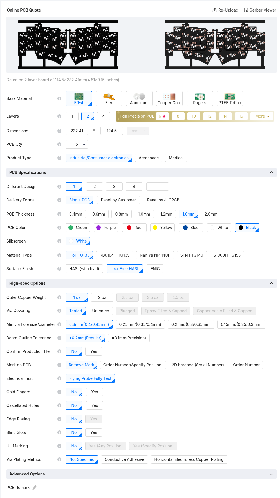
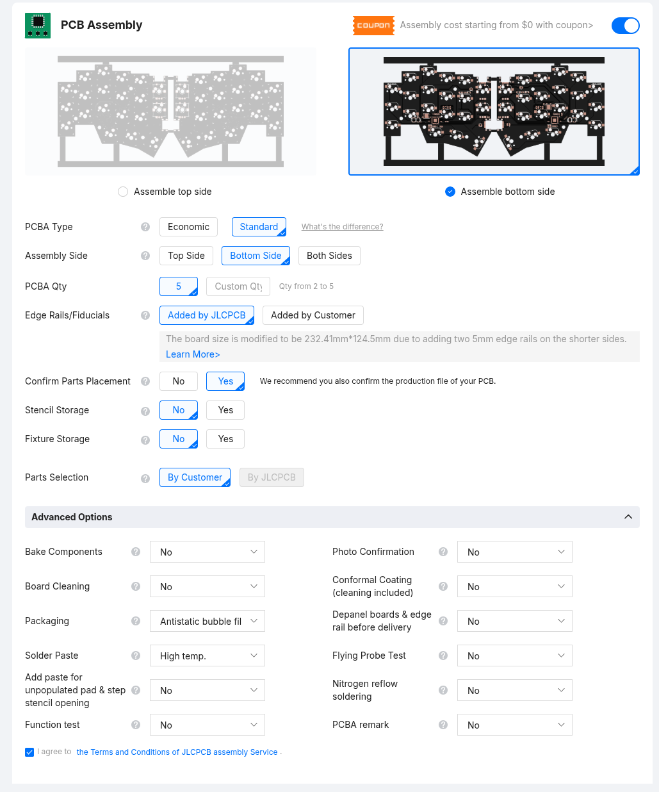
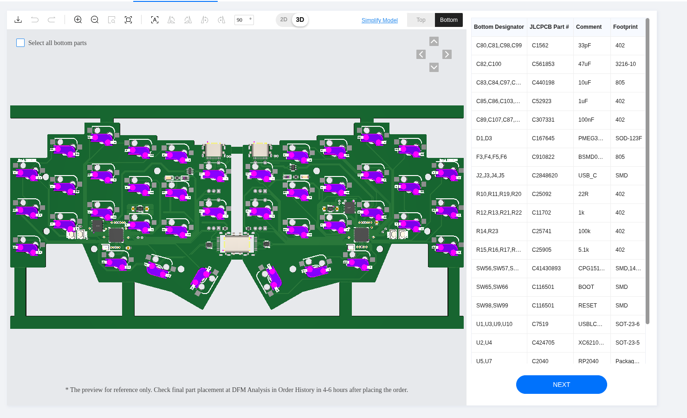

# Ordering Guide

This guide will show an example of how to order this keyboard on [JLPCB](https://jlcpcb.com/).

---

1. Download the files found under `pcb/` (gerber, bom, and cpl).

1. Go to JLCPCB and select "Order Now" on the top right corner.

2. Click on "Add gerber file" and upload the gerber file: `pcb/gerber_cornifi_usb-c.zip` (this may take a while).

3. Most settings default values are good, here are the ones you may want to change:
    1. PCB color: whatever you like
    1. Surface Finish: LeadFree HASL

4. At the bottom, enable "PCB Assembly"
    1. PCBA Type: Standard
    1. Assembly Side: Bottom Side
    1. Confirm Parts Placement: **Yes** (this is important)

5. Click "Next", you will see you PCB, click "Next" again.

6. You should see two upload boxes, for the CPL and BOM files, and click "Next".
    1. BOM: `pcb/bom_cornifi_usb-c.xslx`
    1. CPL: `pcb/cpl_cornifi_usb-c.xslx`

7. You will see a list of components to be assembled. Some manual adjustments may be needed, check if there are any warnings or unselected components:

You need to select all components before going further, so resolve all the warnings or select any missing components, then click "Next".

8. You will then see the PCB with the components placed for assembly. They will most likely be in the wrong spot, but the option "Confirm Parts Placement" will enable a JLCPCB engineer to correct the placement. [0]

9. Choose the Product Category: "Office Appliance and Accessories", then "Keyboard".

10. Save to cart, and voilà!

> [0] There is a bug when uploading gerber generated with KiCad to JLCPCB that messes up the placement of components, but it will be fixed by them as long as you enable the "Confirm Parts Placement" option.
